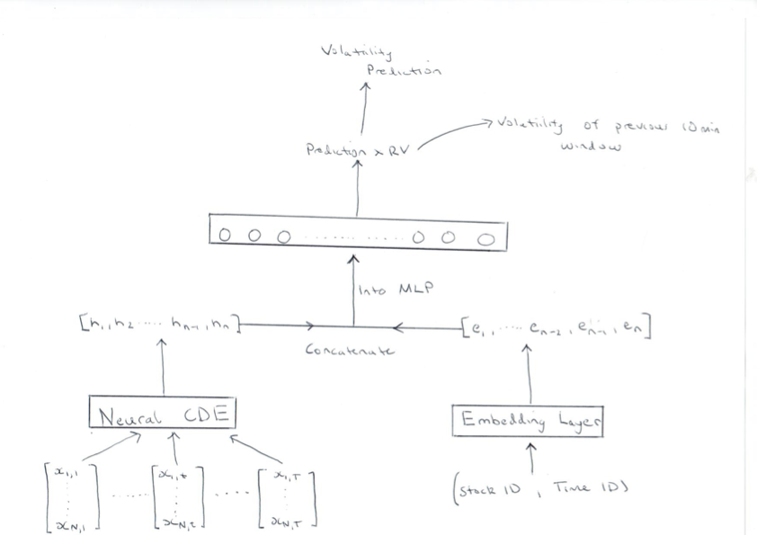

# VolatilityPrediction

Problem statement: Using order and trade data for a specific market at a specific time over a 10 min period, predict the volatility of the next 10 minute period

The dataset is too large to upload to the repo so i have set up a drive at: https://drive.google.com/drive/folders/1JL-Ra6vpPATccnva90Yh1Yruxyj44_-6?usp=sharing

Model Architecture: From the order and trade data a multi-channel time series of features of interest is constructed, using time stamps of book data as the first channel. This time series is fed into the CDE function in order to solve the control differential equation system. Simultaneously, the stock ID and time ID of the window are fed into an embedding layer. The output of the embedding layer is concatenated with the output from the CDE. This vector is then passed into a MLP and a prediction is returned. This prediction is multiplied by the volatility of the previous 10-min window to generate our prediction for the volatility of the coming 10-min window. Visualisation of the model is shown below. Process of data generation and preprocessing is found in DataGeneration notebook.

Training: The model was trained for 1000 epochs wwith hyperparameters specified in the ModelTesting Notebook, there one can see training curve.

Results: The model achieved a RMS percentage error of 20.2% on the test set as shown in ModelTesting

The model state dict was downloaded and is uploaded in the repository
